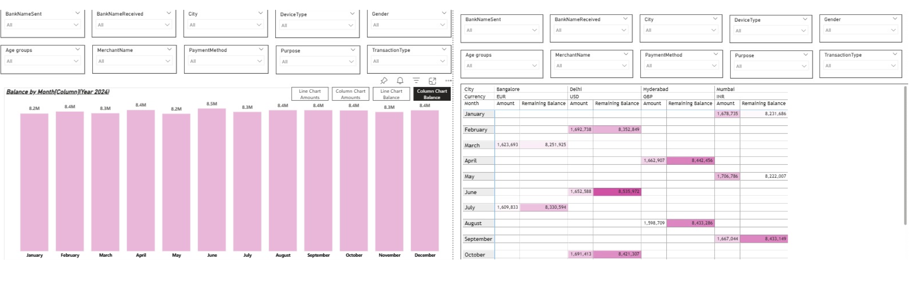

# UPI Transactions Analysis Dashboard


---

##  Project Overview

An end-to-end Business Intelligence solution analyzing **UPI (Unified Payments Interface)** transaction data using Power BI. This dashboard surfaces critical patterns in transaction volume, peak usage windows, bank-level performance, and failure rates — enabling data-driven decision-making for digital payment optimization.

---

##  Business Objectives

| # | Objective |
|---|-----------|
| 1 | Analyze transaction volume trends over time |
| 2 | Identify peak transaction hours and months |
| 3 | Measure transaction success vs. failure rates |
| 4 | Compare bank-wise performance metrics |
| 5 | Generate actionable insights for digital payment optimization |

---

##  Dashboard Preview



---

##  Repository Structure

```
UPI-Transactions-Analysis/
│
├── UPI_Analysis.pbix          # Power BI report file
├── data/
│   └── upi_data.csv           # Raw transaction dataset
├── screenshots/
│   └── dashboard.png          # Dashboard preview
└── README.md
```

---

##  Tools & Technologies

| Tool | Purpose |
|------|---------|
| **Power BI Desktop** | Dashboard development & visualization |
| **DAX** | Custom KPI calculations & measures |
| **Excel / CSV** | Source dataset |
| **Power Query** | Data cleaning & transformation |

---

##  Key KPIs

- **Total Transactions** — Aggregate count of all UPI transactions
- **Total Transaction Amount** — Cumulative value processed
- **Success Rate %** — Proportion of successfully completed transactions
- **Failure Rate %** — Proportion of failed or declined transactions
- **Monthly Transaction Growth** — Month-over-month growth rate
- **Bank-wise Transaction Distribution** — Volume and success breakdown per bank

---

##  Key Insights

>  **Peak Hours** — Transaction activity spikes significantly during evening hours, suggesting after-work usage patterns.

>  **Growth Trend** — A consistent month-over-month increase in transaction volume reflects accelerating adoption of digital payments.

>  **Bank Performance** — Certain banks demonstrate notably higher success rates, indicating superior infrastructure and API reliability.

>  **Failure Correlation** — Failure rates are disproportionately higher during peak-volume periods, pointing to capacity and load-handling gaps.

---

##  Skills Demonstrated

- ✅ Data Cleaning & Preparation (Power Query)
- ✅ Relational Data Modeling
- ✅ DAX Measures & Calculated Columns
- ✅ KPI Dashboard Design
- ✅ Business Insight Generation
- ✅ Data Storytelling & Visual Communication

---

## Live Dashboard

. Live Dashboard:[Click Here](https://app.powerbi.com/groups/me/dashboards/779aa1a4-872e-4549-98e5-37588807e9ee?experience=power-bi)

---

##  Connect

Feel free to explore the dashboard, raise issues, or reach out for collaboration.

